<div align="center">
  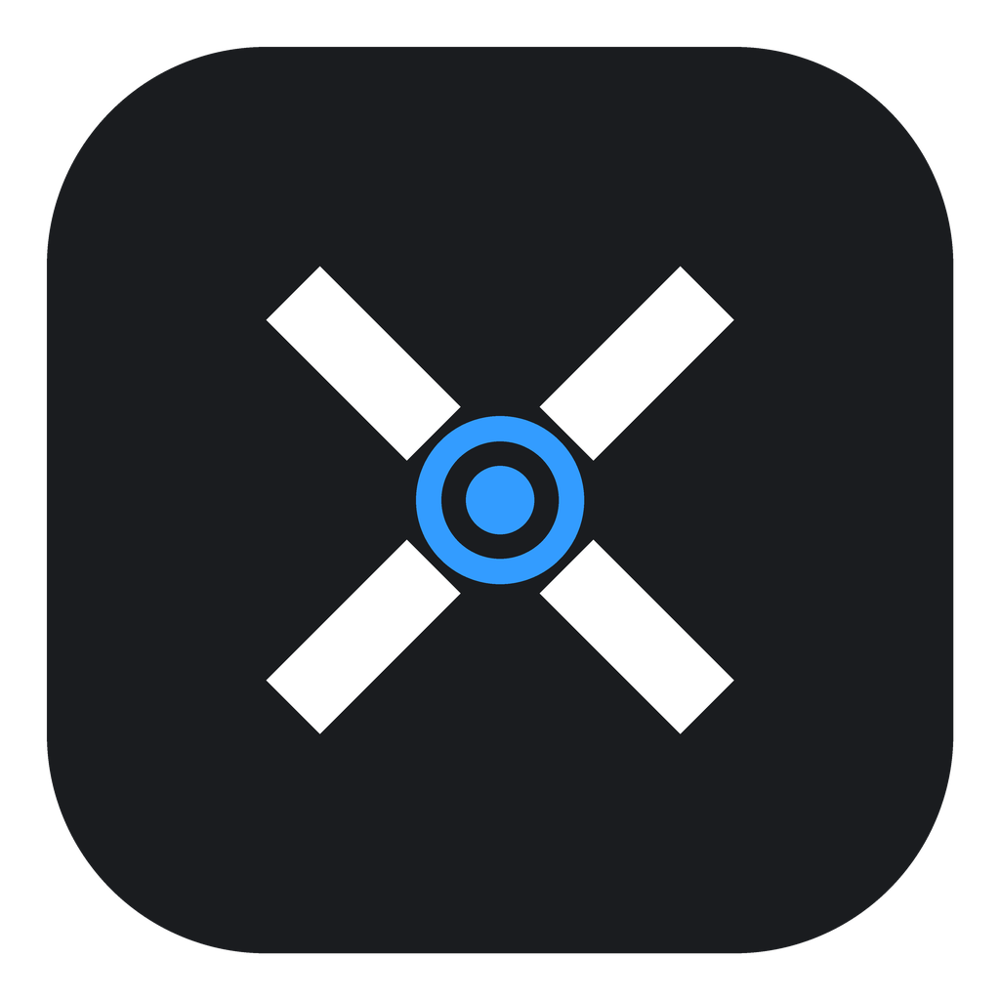
  <h1>Xen</h1>
  <p><strong>从画面采集到视觉控制，从数据审核到模型训练。</strong></p>
  <p>C++20 构建的 Windows 实时视觉工作台</p>
  <p>
    
    
    
    
    <a href="LICENSE"></a>
  </p>
  <p>
    <a href="#功能概览">功能概览</a> ·
    <a href="#界面预览">界面预览</a> ·
    <a href="#实测精选">实测精选</a> ·
    <a href="#快速开始">快速开始</a> ·
    <a href="#项目架构">项目架构</a> ·
    <a href="#构建与开发">构建与开发</a> ·
    <a href="#仓库结构">仓库结构</a> ·
    <a href="#使用指南">使用指南</a> ·
    <a href="https://github.com/hpsazz1/Xen/wiki">Wiki</a> ·
    <a href="https://github.com/users/hpsazz1/projects/1">项目看板</a>
  </p>
</div>

---

Xen 将**采集、检测、瞄准、辅助控制、数据整理和训练**集中在一个原生桌面界面中。既能处理本机桌面画面，也能接入双机视频源；使用不同的推理后端适配硬件，并保留可回放、可比较的运行记录。

项目追求“小而美的瑞士军刀”：让每项能力有明确入口，让配置、数据和结果可以追溯。

**正式版本：[2026.09.29](https://github.com/hpsazz1/Xen/releases/tag/v2026.09.29)** · [发布说明与验证范围](assets/guide/releases/2026-09-29.md)。公开版本提供源码与精选演示；模型、运行库和本机配置按指南准备。

## 功能概览

| 模块 | 可以做什么 |
| :-- | :-- |
| **画面采集** | 本机 DXGI 桌面采集，以及 UDP MJPEG、XUDP JPEG、NDI 视频输入；支持双机工作流。 |
| **模型推理** | 通过 ONNX Runtime 运行检测、分割、姿态和旋转框模型；提供模型选择、类别筛选和热重载。 |
| **瞄准控制** | 目标追踪与选择、范围及瞄点设置、延迟补偿；结合 GSI 上下文进行可选的阵营筛选。 |
| **辅助控制** | 自动扳机、移动急停联动、按武器管理弹道；统一显示输入许可、暂停与故障原因。 |
| **采集与审核** | 按需保存原图和预测，整理重复及疑难样本，批量预览、人工修订并导出训练数据。 |
| **模型训练** | 专用 Python 环境检查、可信 PT 校验、训练与取消/恢复、独立评价、ONNX 导出和候选导入。 |
| **诊断与回放** | 性能信息、运行报告、输入录制、离线分析和对照工具，帮助定位问题与比较结果。 |

**推理后端**：CPU · CUDA · TensorRT · DirectML · OpenVINO<br>
**输入后端**：Win32 SendInput · KMBOX NET · MAKCU

各后端的能力与依赖不同，例如自动急停当前仅支持 KMBOX NET。模型也需满足对应输出契约；支持某种任务类型不等于任意 ONNX 都能直接使用。

## 界面预览

以下图片以当前版本重新生成，统一使用白色主题。画面由生产 UI 渲染，使用无设备演示状态与示例路径；展示功能入口，不代表实时性能或实战效果。

### 采集与批量审核

素材保存、状态查看和批量审核在同一页面完成。未检测到目标的图片仍需审核，不会直接当作负样本。

<p align="center">
  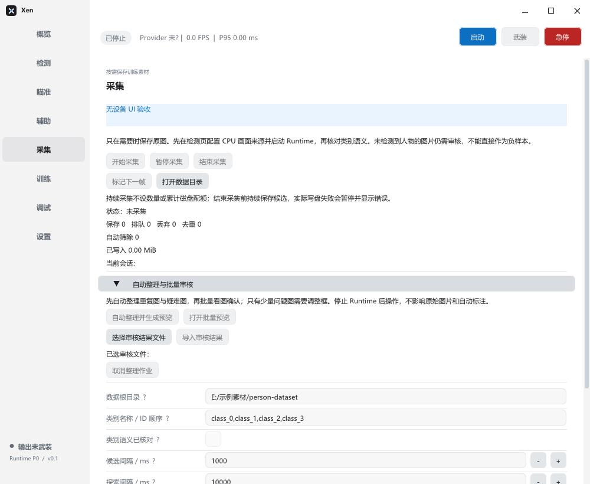
</p>

<table>
  <tr>
    <th width="50%">瞄准与阵营筛选</th>
    <th width="50%">训练与候选评价</th>
  </tr>
  <tr>
    <td>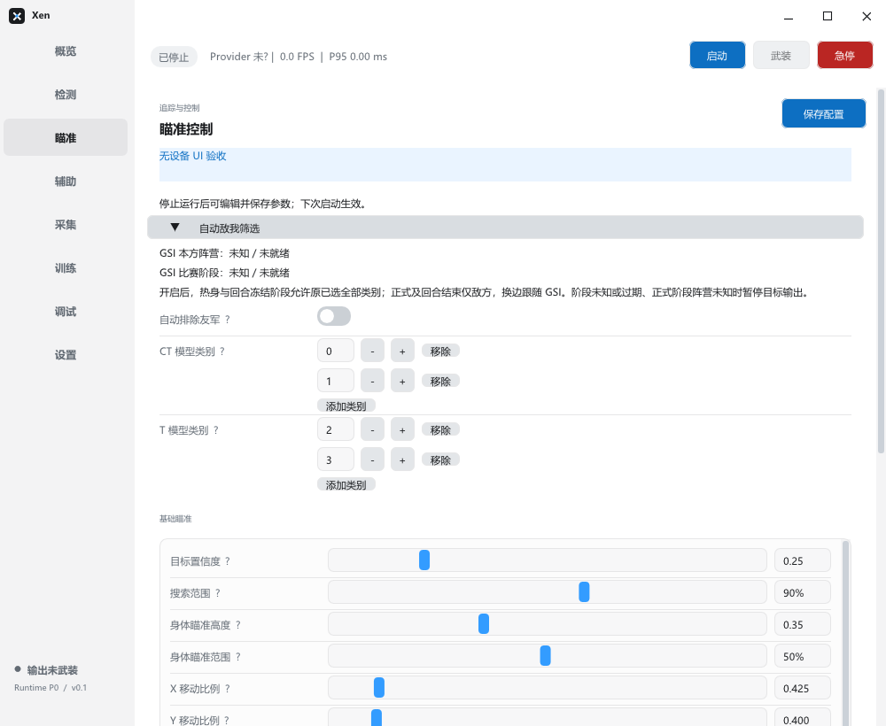</td>
    <td>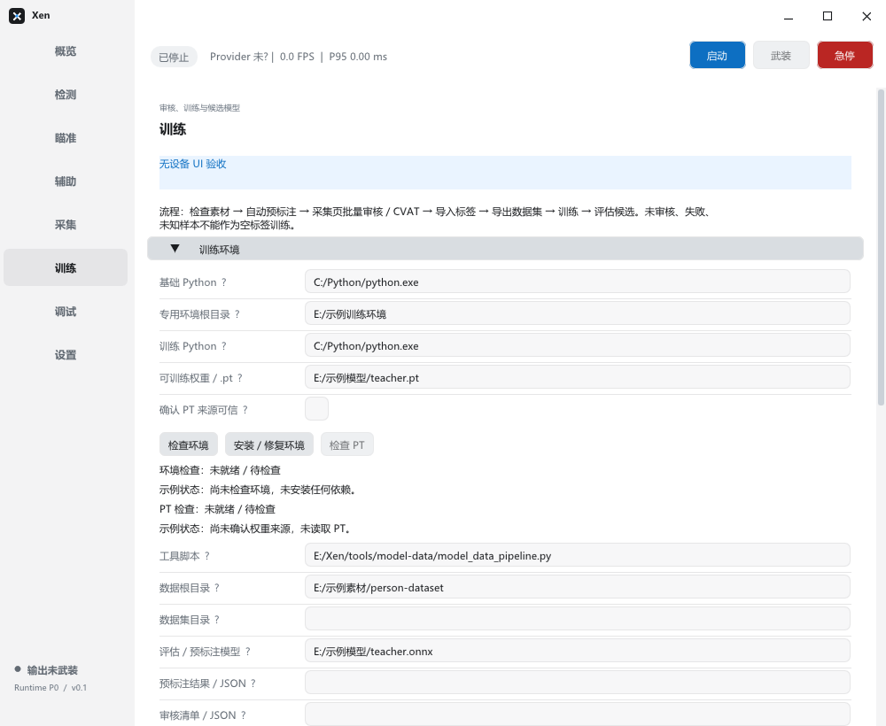</td>
  </tr>
  <tr>
    <td>按模型设置类别映射，调整目标选择和控制参数。</td>
    <td>检查专用环境与可信权重，准备训练和独立评价。</td>
  </tr>
</table>

## 实测精选

以下片段来自 2026-09-29 的实际测试录像。用户完成压枪、急停＋扳机及实战测试后，反馈整体效果可以接受。片段保留原速，裁去昵称和聊天区域；GIF 为轻量预览，点击下方 MP4 可查看更清晰的版本。

| 压枪 · 5 秒 | 急停＋扳机 · 6 秒 |
| :--: | :--: |
| 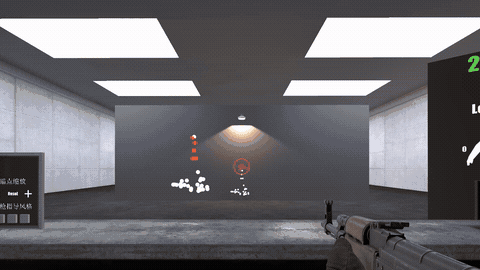 | 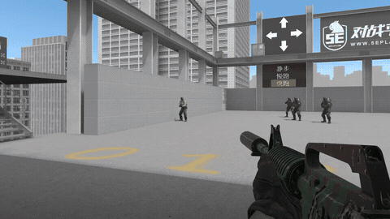 |
| [查看 MP4](https://github.com/hpsazz1/Xen/releases/download/v2026.09.29/recoil.mp4) | [查看 MP4](https://github.com/hpsazz1/Xen/releases/download/v2026.09.29/stop-trigger.mp4) |

<p align="center">
  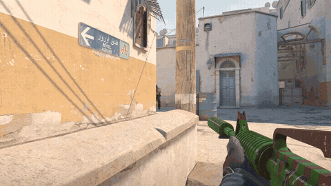
</p>

<p align="center">实战片段 · 5 秒 · <a href="https://github.com/hpsazz1/Xen/releases/download/v2026.09.29/match.mp4">查看 MP4</a></p>

精选片段展示使用场景，不据此推导命中率、急停时延或跨环境效果。[素材说明](assets/readme/showcase/README.md)记录时长、处理方式和权利边界。

### 追踪、补偿与预测

三段按相同倍率放大准星附近画面，右上角叠加运行日志中的**基础瞄点 → 预测瞄点**及两点距离。绿点为基础瞄点，橙圈为预测瞄点；像素值按原画面计算，放大不改变数值。

**基础追踪** · 原录像 1–6 秒 · [查看高清 MP4](https://github.com/hpsazz1/Xen/releases/download/v2026.09.29/tracking.mp4)

<p align="center">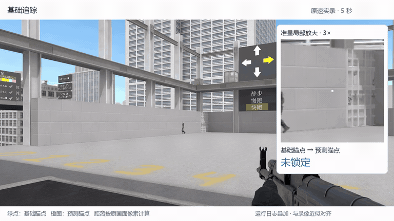</p>

**基础＋补偿** · 原录像 2–7 秒 · [查看高清 MP4](https://github.com/hpsazz1/Xen/releases/download/v2026.09.29/tracking-compensation.mp4)

<p align="center"></p>

**基础＋补偿＋预测** · 原录像 16–21 秒 · [查看高清 MP4](https://github.com/hpsazz1/Xen/releases/download/v2026.09.29/tracking-prediction.mp4)

<p align="center">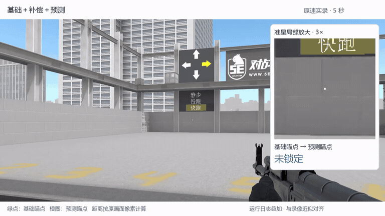</p>

三段均开启死区和软化区：死区为 **1.5 px**，软化区半径为 **30%**，最小强度为 **20%**。除补偿、预测开关外，其余瞄准配置一致。未开启预测时两点重合，显示 0 px；延迟补偿作用于控制过程，不能用这段连线的长度衡量。日志与录像经目标位置近似对齐，标记用于解释瞄点关系，不作为逐帧物理时延测量；未锁定时不显示有效距离。

## 快速开始

### 1. 选择运行方式

| 使用方式 | 入口 | 注意事项 |
| :-- | :-- | :-- |
| 已配置的交付包 | 包根目录的 `Start-Xen.cmd` | 封装可能包含本机源端绑定；使用本机已配置的版本。 |
| 标准多后端包 | 包根目录的 `XenLauncher.exe` | 由启动器选择匹配的 Worker，不直接启动 `runtimes/` 内的程序。 |
| 自行编译 | 构建输出中的 `Xen.exe` | 先完成下方构建步骤，依赖随构建配置部署。 |

首次使用前准备 Windows x64、匹配硬件的运行库，以及符合输出契约的 ONNX 模型。模型权重和设备配置需要自行准备。

### 2. 接通画面与模型

1. 将模型放入程序数据根的 `models/`，在**检测**页刷新、选择并应用。
2. 设置画面来源和推理后端；双机使用时先确认源端视频可达。
3. 手动启动 Runtime，保持输出未武装，核对预览、类别、日志与后端状态。
4. 停止 Runtime 后修改并保存控制参数，再按需要启用功能。

> 真实输出由用户手动启动与武装。先确认设备、前台焦点和输入状态，保留按住启用及 End 急停；只在私有、离线或明确允许的环境使用。软件报告中的“预计完成”和设备 ACK 不等于实际停稳或实战验收通过。

### 3. 按任务进入对应页面

| 想做的事 | 从哪里开始 |
| :-- | :-- |
| 调整识别模型、阈值和画面输入 | **检测** |
| 调整追踪、范围、瞄点和阵营类别 | **瞄准** |
| 配置扳机、急停或弹道 | **辅助** |
| 保存新场景素材、审核标注 | **采集** |
| 检查训练环境、训练并评价候选 | **训练** |
| 查看运行诊断、录制与离线结果 | **调试** |

## 数据与模型工作流

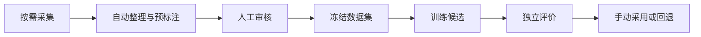

双机部署中，**辅机仅采集，训练在主机进行**。按会话或对局划分训练、验证和测试集，避免相邻帧跨集合；候选经过独立评价后再决定是否采用，训练完成不会自动替换现役模型。

运行数据以程序根目录为基准，与启动时的工作目录无关：

| 目录 | 内容 |
| :-- | :-- |
| `models/` | 推理模型 |
| `cache/datasets/` | 采集素材与审核数据 |
| `cache/model-workspace/` | 工作台设置、训练作业和结果 |
| `cache/recoil/` | 用户弹道、校准与优化资料 |
| `cache/runtime/` | 运行报告与归档 |
| `logs/` | 应用日志 |

**不要直接清空整个 `cache/`。** 其中包含用户数据与验收证据；升级前保留配置、模型、弹道和所需记录。训练环境也应重新检查绑定，不能把另一台机器的 Python 路径直接复制过来。

## 项目架构

实时处理由 Runtime 统一协调；原生界面负责配置和状态展示，模型工作台负责采集后的审核、训练与评价。下图表示主要职责与数据流，不对应固定的线程数量。

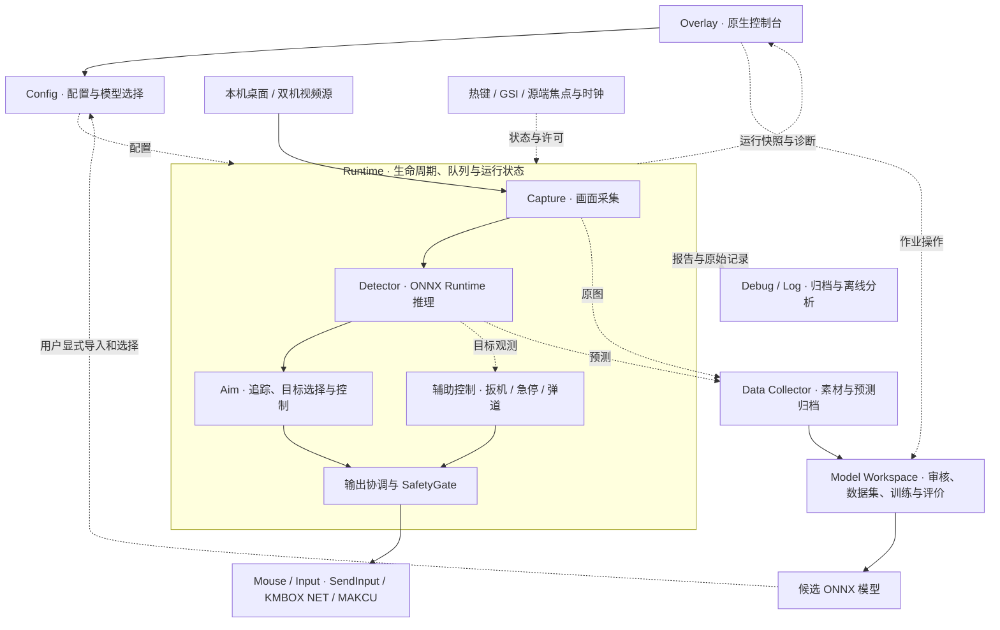

- **实时链路**：采集、推理与控制在 Runtime 中协作，设备输出受统一许可与清理流程约束。
- **模型闭环**：素材与预测用于审核和训练；候选由用户显式采用，不自动替换正在使用的模型。双机部署的训练作业在主机执行。
- **诊断链路**：运行报告和原始记录用于离线分析，帮助区分图像、推理、控制与设备回执问题。

## 构建与开发

核心技术栈：**C++20 · CMake · ONNX Runtime · OpenCV · Dear ImGui · spdlog**。

需要 Windows x64、带 C++ 桌面开发组件的 Visual Studio 2026 / MSVC v14.51、CMake 3.18+、ONNX Runtime SDK 和 OpenCV。启用测试时，还需 PowerShell 7，以及可导入 NumPy、OpenCV 的 Python 3。

```powershell
$env:ONNXRUNTIME_ROOT = "C:\path\to\onnxruntime"
$env:OpenCV_DIR = "C:\path\to\opencv\build\x64\vc16\lib"

cmake -S . -B build -G "Visual Studio 18 2026" -A x64 `
  -DOpenCV_DIR="$env:OpenCV_DIR" `
  -DBUILD_TESTING=ON

cmake --build build --config Release --target xen_app --parallel
```

输出为 `build/Release/Xen.exe`。CUDA、TensorRT、DirectML、OpenVINO 和 NDI 需使用匹配 SDK；各推理发行包使用独立构建目录。完整构建、运行库核验与发布参见[开发指南](assets/guide/development.md)。

## 仓库结构

下面列出主要源码与公开资料。各模块如何协作见[项目架构](#项目架构)，定位具体功能见[开发指南的代码导航](assets/guide/development.md#源码与验证)。

```text
仓库根目录/
├── Xen/                    C++ 应用与功能模块（选列）
│   ├── app/                应用入口、启动器与模型目录
│   ├── overlay/            原生界面与功能面板
│   ├── config/             配置读取、保存与校验
│   ├── capture/            本机与网络画面输入
│   ├── detector/           推理、预处理与后处理
│   ├── aim/                目标追踪、选择与瞄准控制
│   ├── runtime/            运行生命周期、队列与安全门
│   ├── mouse/              输入设备后端
│   ├── trigger/            自动扳机
│   ├── auto_stop/          急停策略与事务
│   ├── recoil/             弹道档案与执行
│   ├── data_collection/    素材与预测采集
│   └── model_workspace/    审核、数据集与训练作业编排
├── scripts/                构建、数据处理、训练与发布脚本
├── tests/                  单元、集成、契约测试与夹具
├── assets/
│   ├── guide/              分类使用与开发指南
│   ├── readme/             首页界面截图及来源说明
│   ├── recoil/             弹道导入说明与清单
│   └── reference_assessment/ 参考评估示例与第三方许可
├── CMakeLists.txt          依赖、构建目标与测试登记
├── LICENSE                 MIT 许可证
└── README.md               项目介绍与使用入口
```

构建输出 `build/`、运行数据 `cache/` 和本地配置不属于上述源码目录。发布包的目录布局另见[运行与发布目录](assets/guide/development.md#应用启动与发布布局)。

## 使用指南

| 指南 | 内容 |
| :-- | :-- |
| [采集、审核与训练](assets/guide/training.md) | 从素材整理到训练环境、模型评价与候选管理。 |
| [瞄准、辅助与弹道](assets/guide/controls.md) | 控制设置、阵营筛选、自动扳机、急停与弹道工作流。 |
| [录制、分析与实验工具](assets/guide/tools.md) | 输入评价、离线对照、有界测试及命令参数。 |
| [构建与开发](assets/guide/development.md) | 依赖、可执行目标、脚本入口、运行目录和诊断。 |
| [独立参考评估](assets/reference_assessment/GUIDE.md) | 参考评分与 Xen 输入评估的并列比较。 |

## 反馈与贡献

| 需要什么 | 入口 |
| :-- | :-- |
| 使用帮助与排查 | [Wiki 使用手册](https://github.com/hpsazz1/Xen/wiki) · [支持说明](SUPPORT.md) |
| 查看开发与发布进度 | [项目看板](https://github.com/users/hpsazz1/projects/1)，区分待处理、进行中、待验收与已完成。 |
| 报告故障或提出建议 | [问题模板](https://github.com/hpsazz1/Xen/issues/new/choose) |
| 提交代码或改进文档 | [贡献指南](CONTRIBUTING.md) |
| 报告安全漏洞 | [安全政策与私密渠道](SECURITY.md) |
| 了解社区交流规范 | [行为准则](CODE_OF_CONDUCT.md) |

反馈时请说明提交或包版本、推理后端、画面来源、复现步骤与预期行为，并附脱敏日志或截图。不要上传设备凭据、个人配置或未经许可的数据。

公开文档由 GitHub Actions 检查本地链接和基本格式。代码修改优先构建受影响目标并运行相关测试；构建测试、离线评价和真实设备验收分别记录。

## 致谢与许可说明

感谢 ONNX Runtime、OpenCV、Dear ImGui、spdlog、SimpleIni、nlohmann/json 及相关项目。独立输入评估参考的 cs-match-hud 许可与来源保存在 [reference_assessment](assets/reference_assessment/)。

Xen 原创源码及随附文档采用 [MIT License](LICENSE)，允许使用、修改、商用和再分发，须保留版权及许可声明；软件按原样提供，不提供担保。

第三方代码、依赖及另有声明的材料仍遵循各自许可证。项目的 MIT 授权不替代模型权重、外部数据或其他第三方素材的授权；使用与分发这些材料时需另行核对。
