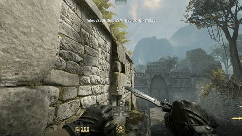
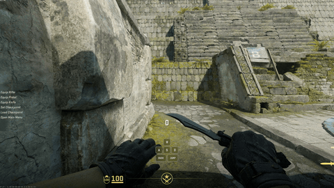

# 身法：旋转跳与 Long Jump

[返回 README](../../README.md#身法演示) · [完整控制说明](controls.md)

两项功能都在**辅助 → 身法**中，当前需要 KMBOX NET。先打开身法总开关，再选择要使用的动作；旋转跳和 Long Jump 可以分别开关。

新配置的身法总开关默认关闭，两项动作和 Ctrl 子项预先选中。发行参数为旋转跳 90°/200ms、Long Jump 每侧 25°/170ms、Ctrl 延迟650ms并保持200ms、动作后保护150ms，滚轮使用 relative 报告。已有配置保留自己的值；这些是起始参数，不保证所有场景效果相同。

| 功能 | 可以做什么 | 默认触发 |
|---|---|---|
| 旋转跳 | 跳跃时配合方向键转动视角 | 滚轮向上 |
| Long Jump | 跳跃时依次向左、向右转动，可配合一次定时蹲键 | 滚轮向下 |

## 怎么开始

1. 在**设置**中确认 KMBOX NET 已连接，按键和急停设置正确。
2. 在**辅助 → 身法**中启用所需动作，选择触发方式。两项功能使用不同的触发。
3. 在游戏内把对应滚轮方向或按键绑定为跳跃。Xen 配合这次跳跃做动作，不额外补发跳跃。
4. 由你手动启动并允许输出，在合适的练习环境中尝试；按 **End** 可急停。

角度决定转动幅度，时长决定动作持续多久。Long Jump 的角度和时长按每一侧设置。先用自己的现有配置，再按实际体验调整；录像里的效果不保证在其他点位复现。

Long Jump 的蹲键按设定时间触发，并不会判断是否落地。

## 看看效果

**Long Jump · 原速 4.4 秒**

**旋转跳 · 原速 7.5 秒**

两段来自用户于 2026-10-07 提供的录像。[素材说明](../readme/showcase/README.md#身法展示)记录剪辑和显示规格。
